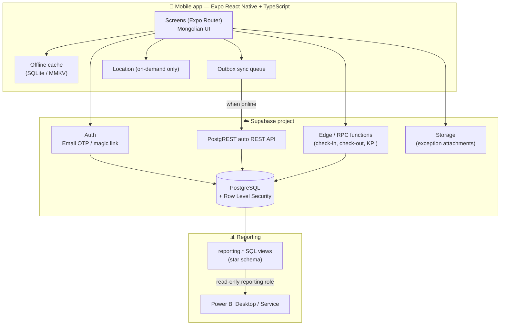
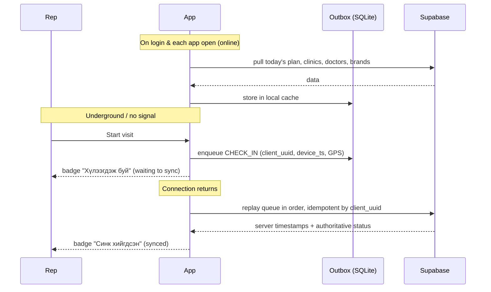

# 01 — Proposed Architecture

**Project:** Doctor Visit Tracker (Эмчийн уулзалтын бүртгэл)
**Audience of this document:** technical reviewers. A plain-language version is in `docs/90-setup-for-non-technical.md`.

---

## 1. Plain-language summary (read this first)

The system has three parts:

1. **The phone app** — what the seven medical representatives and the managers actually touch. Installed on iOS and Android.
2. **The database + server** — hosted by Supabase. It stores every clinic, doctor, plan and visit, and it *enforces the rules*. If the phone app is bypassed or hacked, the server still refuses illegal actions.
3. **The reporting layer** — a set of clean, read-only database "views" that Power BI connects to directly.

The important design decision: **the phone is never trusted.** Times, permissions, distances and KPI numbers are all recalculated and enforced on the server.

---

## 2. High-level component diagram



---

## 3. Technology choices and *why*

| Layer | Choice | Reason |
|---|---|---|
| Mobile framework | **Expo (React Native) + TypeScript** | One codebase for iOS + Android; Expo handles builds and OTA updates without a Mac in the office; TypeScript catches mistakes before they reach users. |
| Navigation | **Expo Router** (file-based) | Screens map to files, so the 23-screen structure stays readable. Deep links work for free. |
| Database | **PostgreSQL 15+ (Supabase)** | Row Level Security is a first-class feature — this is what makes "a representative cannot read another representative's plan" a *database* guarantee, not a UI guarantee. |
| Auth | **Supabase Auth, email OTP** | No passwords to leak or reset. Restricted to approved company domains by a server-side hook + a database trigger (defence in depth). |
| Server logic | **Postgres functions (RPC)**, Edge Functions only where needed | Check-in/check-out must be atomic and use the *server* clock. A Postgres function gives us `now()` from the server and a single transaction. |
| Offline | **expo-sqlite** cache + **outbox queue** table | Visits created underground / in a lift are never lost. |
| Files | **Supabase Storage**, private bucket + signed URLs | Exception attachments (e.g. photo of a closed clinic door). |
| Reporting | **`reporting` schema of SQL views + a dedicated read-only DB role** | Power BI connects with a login that can only `SELECT` from views — it can never see `auth.users` or write anything. |
| Tests | **Vitest** (logic + SQL rule tests via pgTAP-style assertions) | Fast, TypeScript-native. |

### Version policy
Latest stable, mutually compatible versions are pinned in `package.json` and recorded in `docs/95-known-limitations.md`. No secret is ever written in source code — see §7.

---

## 4. Trust boundaries — what runs where

| Rule | Enforced where | Why not on the phone |
|---|---|---|
| Only approved email domains may log in | Postgres trigger on `auth.users` + Supabase auth hook | A phone can be modified; the DB cannot be bypassed. |
| A rep sees only their own plans | **RLS policy** | UI filtering is cosmetic. |
| Visit may only start inside the geofence | **`fn_start_visit()` Postgres function** recomputes the Haversine distance from the *submitted* coordinates against the clinic row | The phone could send `distance = 0`. The server never accepts a client-computed distance. |
| Check-in time | `now()` inside the function (server clock) | Phone clocks can be changed. Device time is *also* stored, and a mismatch is flagged as an exception signal. |
| Completed visits are immutable | `BEFORE UPDATE` trigger raises an exception | — |
| KPI numbers | SQL view + versioned rule config | Everyone must see the same number. |

> **Design rule:** the mobile app may *disable* a button for usability, but the server must *reject* the action independently. Every screen in this app follows that rule.

---

## 5. Authentication — and how we swap to Microsoft Entra ID later

Today: Supabase Auth email OTP → issues a JWT → JWT carries `sub` (auth user id).

The application **never reads the identity provider directly**. Instead:

```
auth.uid()  ──►  app_user  ──►  app_user_role  ──►  permissions
              (mapping table)
```

* `app_user` holds `auth_user_id`, `email`, `full_name`, `role`, `is_active`.
* Every RLS policy and every function resolves the caller through `fn_current_app_user()`.
* The mobile app talks to a thin `src/lib/auth/` module with an `AuthProvider` interface.

**Migration path to Entra ID** (documented, not built):
1. Register the app in Entra ID; enable Supabase's SAML/OIDC enterprise SSO **or** point the app's `AuthProvider` at MSAL.
2. Set `app_user.auth_user_id` to the new provider's subject id (a one-column backfill keyed on `email`).
3. No RLS policy, no table, and no screen changes — because nothing references the provider directly.

This is the single most important reason for the `app_user` indirection table.

---

## 6. Offline architecture



Key rules:
* Every offline-created record carries a **client-generated UUID**. Replaying it twice is a no-op (`ON CONFLICT (client_uuid) DO NOTHING`) — this prevents duplicates on flaky networks.
* The server stamps its own `server_ts`; the device's `device_ts` is stored alongside for audit and drift detection.
* Sync state is always visible: **Синк хийгдсэн / Хүлээгдэж буй / Синк амжилтгүй**.
* Conflicts: transactional visit data is append-only, so genuine conflicts are rare. Where they exist (e.g. a manager cancelled the visit while the rep was offline), the **server wins** and the queued item is moved to `failed` with a Mongolian explanation the rep can read.

---

## 7. Secrets and configuration

| Secret | Where it lives | Ever in git? |
|---|---|---|
| Supabase URL, anon key | `.env` locally, EAS "secrets" for builds | No — `.env.example` only |
| Supabase `service_role` key | Server/CI only. **Never in the mobile app** | Never |
| Power BI reporting DB password | Power BI credential store | Never |

`.env.example` documents every variable. `.gitignore` blocks `.env`. The anon key is safe to ship in the app *only because* RLS is on for every table — that is a hard requirement, verified by an automated test.

---

## 8. Repository layout

```
doctor-visit-tracker/
├── app/                     # Expo Router screens (see docs/04)
├── src/
│   ├── lib/                 # supabase client, auth provider, i18n, dates
│   ├── domain/              # PURE business logic (haversine, KPI, eligibility)
│   ├── data/                # repositories, offline cache, outbox queue
│   ├── components/          # shared UI
│   └── theme/               # colours, spacing, typography
├── supabase/
│   ├── migrations/          # numbered, forward-only SQL
│   └── seed/                # test data
├── tests/                   # Vitest: domain rules + SQL policy tests
└── docs/                    # these documents + manuals
```

`src/domain/` contains **no imports from React or Supabase**. That is what makes geofence, eligibility and KPI logic unit-testable without a database or a phone — and the same rules are mirrored in SQL on the server.

---

## 9. Deliberate non-goals for the MVP

* No background/continuous location. Location is read **only** at check-in, check-out, and a manually submitted exception.
* No audio recording (feature-flagged off, see `docs/07-risks.md`).
* No patient data anywhere — enforced by field design and by manual review of free-text guidance.
* No push notifications in Phase 1–7 (listed in known limitations).
