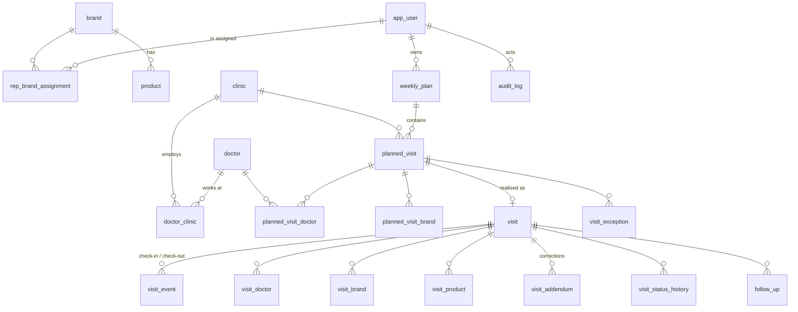

# 02 — Database Schema

All identifiers are English. All timestamps are `timestamptz` stored in UTC and displayed in **Asia/Ulaanbaatar** by the app.

Legend: 🔒 = immutable after creation (enforced by trigger) · ♻️ = soft-deletable master data · 📍 = contains location data

---

## 1. Entity relationship overview



---

## 2. Enumerated types

```sql
user_role            : representative | manager | administrator
plan_status          : draft | submitted | approved | rejected | active | completed | locked
visit_status         : planned | in_progress | completed | missed | rescheduled
                     | cancellation_requested | cancelled_approved | cancelled_unapproved
visit_event_type     : check_in | check_out
meeting_status       : doctor_met | doctor_unavailable | clinic_closed | meeting_postponed
                     | met_clinic_staff_only | other
visit_outcome        : product_introduced | doctor_interested | follow_up_requested
                     | sample_requested | training_requested | not_interested
                     | already_recommending | other
interest_level       : none | low | medium | high
exception_reason     : doctor_unavailable | clinic_closed | emergency | sick_leave
                     | official_assignment | gps_problem | wrong_clinic_coordinates
                     | appointment_rescheduled | other
exception_status     : pending | approved | rejected
sync_source          : online | offline
follow_up_status     : open | done | cancelled
```

Every enum has a Mongolian label in `src/lib/i18n/enums.ts`. The **database stores English codes only** — translation is a presentation concern, so reports never break when wording changes.

---

## 3. Identity & access

### `app_user` ♻️
| Column | Type | Notes |
|---|---|---|
| `id` | uuid PK | app-owned id, stable across auth providers |
| `auth_user_id` | uuid UNIQUE NULL | FK → `auth.users.id`. Nullable so an admin can pre-create a user before first login. **The only column that knows about the identity provider.** |
| `email` | citext UNIQUE NOT NULL | validated against `approved_email_domain` |
| `full_name` | text NOT NULL | |
| `phone` | text NULL | |
| `role` | `user_role` NOT NULL | |
| `manager_id` | uuid NULL FK → app_user | who reviews this rep |
| `is_active` | boolean NOT NULL default true | |
| `deactivated_at` | timestamptz NULL | soft delete |
| `created_at / updated_at` | timestamptz | |
| `created_by / updated_by` | uuid FK → app_user | |

### `approved_email_domain`
`id`, `domain` (citext UNIQUE, e.g. `monos.mn`), `is_active`, audit columns.
Used by a `BEFORE INSERT` trigger on `auth.users` → rejects sign-up from any other domain.

### `app_setting`
Key/value configuration table (`key` text PK, `value` jsonb, `description`, audit columns). Holds:
`gps_accuracy_threshold_m` (default 50), `default_geofence_radius_m` (150), `plan_deadline_weekday` + `plan_deadline_hour`, `on_time_tolerance_minutes` (15), `feature_audio_recording_enabled` (**false**), `retention_days_*`.

---

## 4. Master data

### `clinic` ♻️ 📍
`id` uuid PK · `code` text UNIQUE · `name` text · `clinic_type` text · `district` text · `address` text ·
`latitude` numeric(9,6) · `longitude` numeric(9,6) · `geofence_radius_m` int default 150 ·
`contact_phone` text · `notes` text · `is_active` bool · `deleted_at` timestamptz ·
audit columns.

Constraints: `latitude BETWEEN -90 AND 90`, `longitude BETWEEN -180 AND 180`,
`geofence_radius_m BETWEEN 30 AND 2000`,
`UNIQUE (lower(name), district) WHERE deleted_at IS NULL` → duplicate clinic detection.

### `doctor` ♻️
`id` uuid PK · `code` text UNIQUE · `full_name` text · `speciality` text · `phone` text NULL ·
`email` citext NULL · `professional_notes` text NULL · `is_active` bool · `deleted_at` · audit columns.

> `professional_notes` is documented and labelled in the UI as **professional notes only**. A separate `CHECK` cannot enforce meaning, so this is backed by the privacy checklist and manager review. **No patient-related column exists anywhere in the schema.**

Duplicate doctor detection: `UNIQUE (lower(full_name), lower(speciality)) WHERE deleted_at IS NULL`, plus a soft warning in the admin import when names are ≥ 0.8 similar (`pg_trgm`).

### `doctor_clinic` (many-to-many)
`id` · `doctor_id` · `clinic_id` · `department` · `room_or_floor` · `available_days` text[] ·
`available_hours` text · `is_active` · audit columns. `UNIQUE (doctor_id, clinic_id)`.

### `brand` ♻️
`id` · `code` UNIQUE · `name` · `category` · `is_active` · `deleted_at` · audit columns.

### `product` ♻️
`id` · `code`/`sku` UNIQUE · `name` · `brand_id` FK · `category` · `is_active` · `deleted_at` · audit columns.

### `rep_brand_assignment`
`id` · `rep_id` FK → app_user · `brand_id` FK → brand · `start_date` date · `end_date` date NULL ·
`is_active` bool · audit columns.
Constraint: `end_date IS NULL OR end_date >= start_date`.
Exclusion constraint prevents two overlapping active rows for the same (rep, brand).

---

## 5. Planning

### `weekly_plan`
`id` · `rep_id` FK · `iso_year` int · `iso_week` int · `week_start_date` date · `week_end_date` date ·
`status` `plan_status` · `submitted_at` · `reviewed_by` · `reviewed_at` · `review_comment` ·
`locked_at` · audit columns.
`UNIQUE (rep_id, iso_year, iso_week)` — one plan per rep per week.

### `planned_visit`
| Column | Notes |
|---|---|
| `id` uuid PK | |
| `client_uuid` uuid UNIQUE | idempotency for offline creation |
| `weekly_plan_id` FK | |
| `rep_id` FK | denormalised for fast RLS |
| `clinic_id` FK | |
| `planned_date` date | |
| `planned_order` int | order within the day |
| `planned_time` time NULL | estimated start |
| `objective` text | |
| `status` `visit_status` default `planned` | |
| `rescheduled_to_visit_id` uuid NULL | set when officially moved |
| audit columns | |

**Duplicate prevention:**
`UNIQUE (rep_id, clinic_id, planned_date, doctor_id)` is enforced through a partial unique index on the join table `planned_visit_doctor` combined with `planned_visit` — implemented as a deferred trigger `trg_prevent_duplicate_planned_visit`, because the doctor list lives in a child table. Two *different* reps may plan the same doctor/clinic/date (required by the business).

### `planned_visit_doctor`
`planned_visit_id` · `doctor_id` · PK(both).

### `planned_visit_brand`
`planned_visit_id` · `brand_id` · optional `product_id` · PK(planned_visit_id, brand_id, coalesce(product_id)).

---

## 6. Execution (immutable transactional data)

### `visit` 🔒 (partially)
| Column | Notes |
|---|---|
| `id` uuid PK | |
| `client_uuid` uuid UNIQUE | offline idempotency |
| `planned_visit_id` uuid NULL UNIQUE | NULL ⇒ **unplanned visit** |
| `rep_id`, `clinic_id` | |
| `visit_date` date | derived from server check-in, Asia/Ulaanbaatar |
| `status` `visit_status` | |
| `started_at_server` 🔒 timestamptz | server clock — authoritative |
| `completed_at_server` 🔒 timestamptz NULL | |
| `duration_seconds` generated | `completed_at_server - started_at_server` |
| `meeting_status`, `outcome`, `interest_level` | set at completion |
| `doctor_feedback`, `rep_summary`, `next_action` text | |
| `samples_provided` text NULL, `materials_provided` text NULL | |
| `follow_up_required` bool, `follow_up_date` date NULL | |
| `is_draft` bool | true while the rep fills the form |
| `created_source` `sync_source` | online / offline |
| `app_version` text | |
| audit columns | |

**Immutability rule:** once `status = 'completed'` and `is_draft = false`, a `BEFORE UPDATE` trigger raises
`ERROR: completed visits are immutable; use visit_addendum` for every column except an explicit
manager-run `fn_add_addendum()` path (which does not touch `visit` at all). `DELETE` is revoked for all
application roles.

### `visit_event` 🔒 📍 — the check-in / check-out evidence record
`id` · `visit_id` FK · `event_type` (`check_in`/`check_out`) ·
`server_ts` (default `now()`, **not client supplied**) · `device_ts` timestamptz ·
`latitude` · `longitude` · `gps_accuracy_m` numeric · `distance_from_clinic_m` numeric (**server-computed**) ·
`clinic_id` · `app_user_id` · `planned_visit_id` NULL · `app_version` · `source` `sync_source` ·
`created_at`.
`UNIQUE (visit_id, event_type)`. No `UPDATE`/`DELETE` grants — append-only.

### `visit_doctor` / `visit_brand` / `visit_product`
Join tables recording who was actually met and what was actually discussed.

### `visit_addendum`
`id` · `visit_id` FK · `correction_text` · `reason` · `author_id` · `created_at`. Append-only.
This is the **only** way to correct a completed visit; the original row is never overwritten.

### `visit_status_history`
`id` · `visit_id` NULL · `planned_visit_id` NULL · `from_status` · `to_status` · `changed_by` · `changed_at` · `note`.
Written by trigger on every status change. Feeds the Power BI "Visit status history" fact.

### `follow_up`
`id` · `visit_id` FK · `doctor_id` · `due_date` · `description` · `status` `follow_up_status` ·
`completed_visit_id` uuid NULL · audit columns.

---

## 7. Exceptions

### `visit_exception` 📍
`id` · `client_uuid` UNIQUE · `planned_visit_id` FK · `visit_id` NULL · `rep_id` ·
`reason_category` `exception_reason` · `explanation` text NOT NULL ·
`attachment_path` text NULL (Supabase Storage key) ·
`requested_at_server` timestamptz · `request_latitude` / `request_longitude` / `request_accuracy_m` (nullable — location optional) ·
`status` `exception_status` default `pending` ·
`manager_comment` text · `approved_by` uuid · `approval_ts` timestamptz ·
`excludes_from_kpi` bool GENERATED — true only when `status='approved'` **and** `reason_category` is in the KPI-excluding set.

Constraint: `approved_by <> rep_id` — a representative can never approve their own exception (also enforced by RLS *and* by the approval function).

---

## 8. Audit

### `audit_log` 🔒
`id` bigserial · `occurred_at` timestamptz default now() · `actor_app_user_id` · `actor_email` ·
`action` text (`login`, `plan_created`, `plan_submitted`, `visit_started`, `visit_completed`,
`exception_requested`, `exception_reviewed`, `addendum_added`, `master_data_changed`,
`user_role_changed`, `data_export`, `audio_accessed`) ·
`entity_type` text · `entity_id` uuid · `before_data` jsonb · `after_data` jsonb ·
`ip_address` inet NULL · `app_version` text.

`REVOKE UPDATE, DELETE` from every role except the Postgres owner. Writes happen inside `SECURITY DEFINER`
triggers/functions so a normal user cannot forge or suppress an entry.

---

## 9. KPI configuration & versioning

### `kpi_rule_version`
`id` · `version_no` int UNIQUE · `effective_from` date · `effective_to` date NULL ·
`config` jsonb (which statuses count in numerator/denominator, on-time tolerance, etc.) ·
`created_by` · `created_at` · `notes`.

### `kpi_period_snapshot`
`id` · `scope` (`rep`/`team`) · `rep_id` NULL · `period_type` (`week`/`month`) · `period_start` · `period_end` ·
`kpi_rule_version_id` FK · computed metric columns · `computed_at`.

**Why:** if the rule changes in October, September's published KPI must not change. Snapshots freeze the number
together with the rule version that produced it.

---

## 10. Offline support tables

`sync_outbox` lives **on the device** (SQLite), not on the server. The server-side idempotency guarantee is the
`client_uuid UNIQUE` column present on `planned_visit`, `visit`, `visit_event` and `visit_exception`.

---

## 11. Reporting schema (see `docs/06-*` and `docs/70-powerbi-guide.md`)

`reporting.dim_user`, `dim_clinic`, `dim_doctor`, `dim_brand`, `dim_product`, `dim_date`,
`fact_visit`, `fact_planned_visit`, `fact_exception`, `fact_follow_up`, `fact_visit_status_history`,
plus `vw_kpi_weekly_rep`.

These are `SECURITY INVOKER` views owned by the `reporting_reader` role, which has `SELECT` **only** on the
`reporting` schema — never on `public` or `auth`.

---

## 12. Data-quality rules implemented at the database level

| Rule | Mechanism |
|---|---|
| Required fields | `NOT NULL` + `CHECK` constraints |
| Duplicate clinic | partial unique index on `(lower(name), district)` |
| Duplicate doctor | partial unique index + `pg_trgm` similarity warning on import |
| Coordinate validation | range `CHECK` + "coordinates inside Mongolia" warning check |
| Email-domain validation | trigger against `approved_email_domain` |
| Orphan prevention | every FK is `ON DELETE RESTRICT` |
| Active/inactive | `is_active` on all master data |
| Soft deletion | `deleted_at` on master data; transactional data is never deleted |
| Created/modified by | `created_by` / `updated_by` set by trigger from `fn_current_app_user()` |
| Immutable transactions | triggers + revoked grants |
