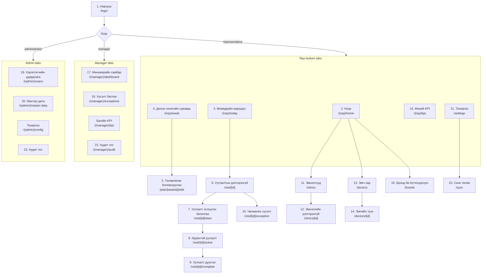

# 04 — Screen List and Navigation Flow

UI language: **Mongolian**. Route paths and component names: English.
Timezone: Asia/Ulaanbaatar. Clock: 24-hour. Date format: `2026.07.27` / `2026 оны 7-р сарын 27`.

---

## 1. Navigation map

Managers and administrators can also open every representative-facing read screen (clinics, doctors,
visit detail) — they just cannot act on them.

---

## 2. Screen specifications

| # | Route | Mongolian title | Who | Purpose & key elements | Primary action |
|---|---|---|---|---|---|
| 1 | `/login` | Нэвтрэх | all | Email field → OTP code field. Shows allowed-domain hint. Rejects non-approved domains with a clear Mongolian message. Offline: explains login needs internet. | **Код авах** → **Нэвтрэх** |
| 2 | `/(rep)/home` | Нүүр | rep | Today's planned count, completed today, remaining today, current-week KPI ring, pending follow-ups, sync-issue banner. | **Өнөөдрийн маршрут руу** |
| 3 | `/(rep)/today` | Өнөөдрийн маршрут | rep | Ordered card list: order no., clinic, doctor names, address, **distance from me**, planned brands chips, status pill, `Газрын зураг` + `Уулзалт эхлүүлэх` + `Чөлөөлөх` buttons. Pull-to-refresh. Offline badge. | **Уулзалт эхлүүлэх** |
| 4 | `/(rep)/week` | Долоо хоногийн хуваарь | rep | 7-day calendar strip + per-day visit counts + plan status pill. | **Төлөвлөгөө засах** |
| 5 | `/plan/[weekId]/edit` | Төлөвлөгөө боловсруулах | rep | Step wizard: week → day → clinic picker → doctor multi-select (filtered by clinic) → brand/product chips (filtered by *my* assignments) → objective → time → drag to reorder. Duplicate warning inline. Draft autosave. | **Ноорог хадгалах** / **Илгээх** |
| 6 | `/visit/[id]` | Уулзалтын дэлгэрэнгүй | rep, mgr | Full plan detail, clinic map thumbnail, doctor list with speciality, previous visit summary for these doctors, status history. | **Уулзалт эхлүүлэх** |
| 7 | `/visit/[id]/start` | Уулзалт эхлүүлэх | rep | Live GPS readout: distance vs radius, accuracy, big green/red state. Lists exactly which of the 7 eligibility conditions failed, in Mongolian. If out of radius: **Чөлөөлөх хүсэлт** instead. | **Баталгаажуулж эхлүүлэх** |
| 8 | `/visit/[id]/active` | Идэвхтэй уулзалт | rep | Running timer from server check-in time, clinic + doctors, quick notes autosave, cannot start another visit. | **Уулзалт дуусгах** |
| 9 | `/visit/[id]/complete` | Уулзалт дуусгах | rep | Structured form (see §3). Validates before allowing submit. Captures check-out GPS. | **Илгээх** |
| 10 | `/visit/[id]/exception` | Чөлөөлөх хүсэлт | rep | Reason category chips, explanation (required), optional photo, optional current location, warning that only a manager can approve. | **Хүсэлт илгээх** |
| 11 | `/clinics` | Эмнэлгүүд | all | Search + district filter, active only by default. | — |
| 12 | `/clinics/[id]` | Эмнэлгийн дэлгэрэнгүй | all | Address, map, radius, contact, doctors working here, my visit history here. | **Газрын зураг дээр нээх** |
| 13 | `/doctors` | Эмч нар | all | Search by name/speciality/clinic. | — |
| 14 | `/doctors/[id]` | Эмчийн түүх | all | Profile + **read-only visit history from all reps**: date, rep, brand, products, outcome, feedback, follow-up, addenda. Filters: date, brand, rep, clinic, outcome. | — (read-only) |
| 15 | `/brands` | Брэнд ба бүтээгдэхүүн | all | Rep sees own assignments highlighted; product list per brand. | — |
| 16 | `/(rep)/kpi` | Миний KPI | rep | Week/month switch, all 13 metrics from `docs/05`, unplanned visits shown **separately**, rule-version label. | — |
| 17 | `/(manager)/dashboard` | Менежерийн самбар | mgr | Team completion KPI, rep ranking, missed visits, pending exceptions, visits started outside expected conditions, clinics not visited, doctors not visited, brand activity, recent-visits map. | — |
| 18 | `/(manager)/exceptions` | Хүсэлт батлах | mgr | Pending queue → detail → approve/reject + mandatory comment. Shows KPI impact before confirming. | **Батлах / Татгалзах** |
| 19 | `/admin/users` · `/admin/user/[id]` | Хэрэглэгчийн удирдлага | admin | Create user, set role, assign manager, activate/deactivate with reason, brand assignments. Email is read-only after creation (it is the link to the login). | — |
| 20 | `/admin/master-data` · `/admin/clinic/[id]` · `/admin/doctor/[id]` | Мастер дата | admin | Clinics / doctors / brands / products create, edit, archive. **GPS & radius editor** with an out-of-Mongolia warning; fuzzy duplicate detection when adding a doctor. CSV import is **not implemented** (see `docs/PHASE-6-STATUS.md`). | — |
| 21 | `/settings` | Тохиргоо | all | Profile, language note, timezone, permissions status, cache size, clear cache, sign out, app version, audio-recording flag shown as **Идэвхгүй** (disabled). | **Гарах** |
| 22 | `/sync` | Синк төлөв | all | Queue list with per-item state: Синк хийгдсэн / Хүлээгдэж буй / Синк амжилтгүй + retry + error reason. | **Дахин оролдох** |
| 23 | `/audit` | Аудит лог | mgr, admin | Filterable, read-only. Export is `fn_export_visits` on the dashboard, not here. | — |
| 24 | `/visit/unplanned` | Төлөвлөгөөнд байхгүй уулзалт | rep | Nearby clinics sorted by distance, reason (required), the same geofence and accuracy rules as a planned check-in, and an explicit note that it never counts towards the KPI. Warns if today's plan already includes the clinic. | **Уулзалт эхлүүлэх** |

---

## 3. Visit completion form — field order (screen 9)

| Order | Mongolian label | Field | Required |
|---|---|---|---|
| 1 | Уулзсан эмч | `visit_doctor[]` | ✓ |
| 2 | Уулзалтын төлөв | `meeting_status` | ✓ |
| 3 | Ярилцсан брэнд | `visit_brand[]` | ✓ |
| 4 | Ярилцсан бүтээгдэхүүн | `visit_product[]` | optional (required if brand has products *and* meeting_status = doctor_met) |
| 5 | Уулзалтын зорилго | `objective` | ✓ (prefilled from plan) |
| 6 | Үр дүн | `outcome` | ✓ |
| 7 | Эмчийн санал хүсэлт | `doctor_feedback` | ✓ |
| 8 | Сонирхлын түвшин | `interest_level` | ✓ |
| 9 | Өгсөн сорьц / материал | `samples_provided`, `materials_provided` | optional |
| 10 | Дараагийн уулзалт шаардлагатай эсэх | `follow_up_required` | ✓ |
| 11 | Дараагийн уулзалтын огноо | `follow_up_date` | ✓ **if** follow_up_required |
| 12 | Дараагийн үйлдэл | `next_action` | ✓ |
| 13 | Товч тайлбар | `rep_summary` | ✓ |
| — | Check-out байршил ба цаг | captured automatically | ✓ (server) |

Conditional logic is defined once in `src/domain/visitValidation.ts` and mirrored in `fn_complete_visit()`.

---

## 4. Cross-cutting UI rules

* **Big targets:** minimum 56 dp height for primary buttons, 48 dp for list rows.
* **Minimal typing:** every field that can be a chip, dropdown or toggle is one. Free text only where meaning
  genuinely varies (feedback, summary, next action, explanation).
* **One obvious primary action** per screen, bottom-anchored, full width.
* **States:** every data screen renders loading / empty / error / offline explicitly — no blank screens.
* **Duplicate submission:** primary buttons disable on press and the request carries a `client_uuid`, so a
  double tap can never create two records.
* **Destructive confirmation:** cancel plan, clear cache, sign out, deactivate user → confirm dialog in Mongolian.
* **Sync badges** appear on every record created on the phone.
* **Accessibility:** minimum 16 sp body text, 4.5:1 contrast, works at the system's largest font setting.
* **Screen sizes:** tested at 360×640 (small Android), 390×844 (iPhone 14), 430×932 (Pro Max) — layouts use
  flex + `SafeAreaView`, never fixed pixel heights.
